## Proof of Concept Architecture Overview

*This simplified architecture is designed specifically for a Proof of Concept (PoC), intentionally omitting elements required for a production-ready solution.*

 

> [!WARNING]
> **It's crucial to note that this architecture is not suitable for production deployment.**

```mermaid
---
config:
  theme: base
  themeVariables:
    primaryColor: '#FFFFFF'
    lineColor: '#FF9800'
---
flowchart RL
 subgraph Datapipeline["D A T A  P I P E L I N E"]
        n12["Data Transformators"]
        n10["Data Integrator"]
        DL["Data Loader <br>&amp; Exporter"]
        ST[("Temporary<br>Filestore")]
  end
 subgraph datagw["Data Gateway"]
        nginx["Security layer<br>"]
        lua["Data filter<br>"]
  end
 subgraph Services["O P E R A T I O N S"]
        datagw
        id{"Access<br>Management"}
  end
 subgraph Apps["Apps"]
        s3["Form Data"]
        t1["Data verification"]
  end
 subgraph Development["Development"]
        ide["💻 Development<br>Environment"]
  end
    %%n15 --> ST
    n10 --> ST
    ST --> n12 & DL
    n12 --> ST
    ide <--> opsconf[("Solution<br>repository")]
    id -.- datagw
    opsconf -.- Datapipeline
    id --- IDP[("Identity<br>Provider")]
    DL --> n16(["K O M B I T <br> TEST"])
    id <-- 🔑 request ---> s3
    s3 -- POST with 🔑 ---> nginx
    nginx -.- lua
    n16 --- t1
     n12:::Aqua
     n10:::Sky,Aqua
     n10:::Aqua
     DL:::Aqua
     ST:::Ash
     nginx:::Sky
     nginx:::Aqua
     lua:::Peach
     datagw:::Sky
     id:::Rose
     s3:::Ash
     s3:::Rose
     t1:::Aqua
     ide:::Peach
     opsconf:::Aqua
     opsconf:::Peach
     opsconf:::Ash
     IDP:::Ash
     n16:::Ash
    classDef default fill:#f9f9f9,stroke:#333,stroke-width:2px
    classDef Sky fill:#E2EBFF,stroke:#374D7C,color:#374D7C,stroke-width:2px
    classDef Rose stroke-width:1px, stroke-dasharray:none, stroke:#FF5978, fill:#FFDFE5, color:#8E2236
    classDef Yellow fill:#FFFACD,stroke:#FFD700,color:#000000,stroke-width:2px
    classDef Peach stroke-width:1px, stroke-dasharray:none, stroke:#FBB35A, fill:#FFEFDB, color:#8F632D
    classDef Ash stroke-width:1px, stroke-dasharray:none, stroke:#999999, fill:#EEEEEE, color:#000000
    classDef Aqua stroke-width:1px, stroke-dasharray:none, stroke:#46EDC8, fill:#DEFFF8, color:#378E7A
    style datagw stroke:#BBDEFB
    style Datapipeline fill:#e0f7fa,stroke:#006064,color:#006064
    style Apps fill:#fff3e0,stroke:#FFD600,color:#FF6D00
    style Services fill:#e8eaf6,stroke:#BBDEFB,color:#1a237e
    style Development fill:#fce4ec,stroke:#FFCDD2,color:#880e4f
```

---
### Benefits and Risks

