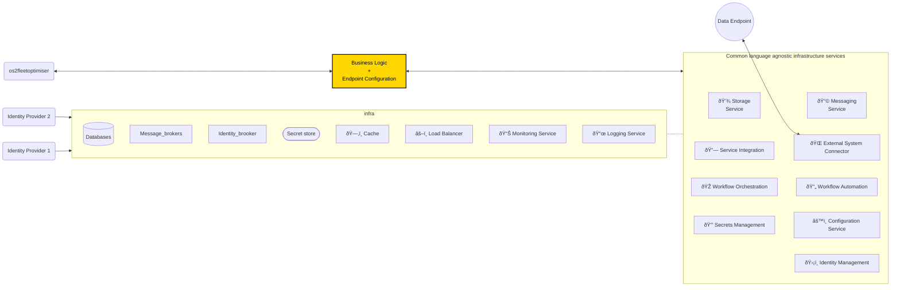

# Case Study 
## Os2fleetoptimiser

```mermaid
flowchart LR

subgraph infra-services["Common language agnostic infrastructure services"]
    direction TB
      Storage["💾 Storage <br> Service"]~~~
      Messaging["📩 Messaging <br> Service"]
      Integration["🔗 Service Integration"]~~~
      Connector["🌠External System Connector"]
      Actors["🎭 Workflow Orchestration"]~~~
      Workflow["🔄 Workflow Automation"]
      Secrets["🔒 Secrets Management"]~~~
      Config["âš™ï¸ Configuration Service"]
      ID["ðŸ›¡ï¸ Identity Management"]
end

subgraph infra
    DBs[(Databases)]
    Message_brokers
    IDB[Identity_brooker]
    Secr(["Secret store"])
     Cache["ðŸ—‚ï¸ Cache"]
    LoadBalancer["âš–ï¸ Load Balancer"]
    Monitoring["📊 Monitoring Service"]
    Logging["📜 Logging Service"]
end

IDP1("Identity Provider 1") --> infra
IDP2("Identity Provider 2") --> infra

infra-.-infra-services

DataProviderA(("Data Endpoint"))<-->Connector

os2f("os2fleetoptimiser")<-->BL["Business Logic <br>+<br> Endpoint Configuration"]<-->infra-services


%% Style for Business Logic
style BL fill:#FFD700,stroke:#000000,stroke-width:2px,color:#000000
```