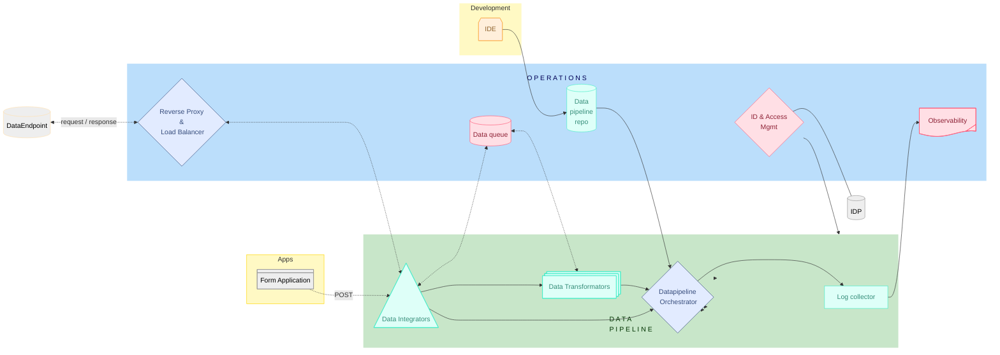

```mermaid
flowchart LR
 subgraph Datapipeline["<br><br><br><br><br><br><br><br>D A T A  <br> P I P E L I N E"]
        n13["Datapipeline<br>&nbsp;Orchestrator"]
        n12["Data Transformators"]
        n10["Data Integrators"]
        log["Log collector"]
  end
 subgraph Services["<br> O P E R A T I O N S"]
        n11[("Data queue")]
        n15["Reverse Proxy <br>&amp;<br>&nbsp;Load Balancer"]
        opsconf[("Data<br>pipeline<br>repo")]
        obs["Observability"]
        id{"ID &amp; Access<br>Mgmt"}
  end
 subgraph Apps["Apps"]
        s3["Form Application"]
  end
 subgraph Development["Development"]
        ide["IDE"]
  end
    s3 ~~~ opsconf
    n11 <-.-> n12
    s2["DataEndpoint"] <-. request / response .-> n15
    n15 <-..-> n10
    s3 -. POST .-> n10
    n10 <-.-> n11
    Datapipeline --> n13 & n13
    n13 ---> Datapipeline
    n12 --> n13
    n10 --> n13 & n12
    opsconf --> n13
    ide --> opsconf
    log --> obs
    n13 --> log
    id --> Datapipeline
    id --- IDP[("IDP")]

    n13@{ shape: diam}
    n12@{ shape: procs}
    n10@{ shape: extract}
    n15@{ shape: decision}
    obs@{ shape: tag-doc}
    s3@{ shape: div-proc}
    ide@{ shape: loop-limit}
    s2@{ shape: cyl}
     n13:::Sky
     n12:::Aqua
     n10:::Sky
     n10:::Aqua
     log:::Aqua
     n11:::Rose
     n15:::Sky
     opsconf:::Aqua
     obs:::Ash
     obs:::Rose
     id:::Rose
     s3:::Ash
     ide:::Peach
     s2:::Ash
     Datapipeline:::Aqua
     IDP:::Rose
     IDP:::Ash
    classDef Peach stroke-width:1px, stroke-dasharray:none, stroke:#FBB35A, fill:#FFEFDB, color:#8F632D
    classDef Aqua stroke-width:1px, stroke-dasharray:none, stroke:#46EDC8, fill:#DEFFF8, color:#378E7A
    classDef Rose stroke-width:1px, stroke-dasharray:none, stroke:#FF5978, fill:#FFDFE5, color:#8E2236
    classDef Sky stroke-width:1px, stroke-dasharray:none, stroke:#374D7C, fill:#E2EBFF, color:#374D7C
    classDef Ash stroke-width:1px, stroke-dasharray:none, stroke:#999999, fill:#EEEEEE, color:#000000
    style s2 stroke:#FFE0B2
    style Datapipeline color:#003300,fill:#C8E6C9,stroke:none
    style Services color:#000055,fill:#BBDEFB,stroke:none
    style Development fill:#FFF9C4,stroke:none
    style Apps fill:#FFF9C4,stroke:#FFD600


```