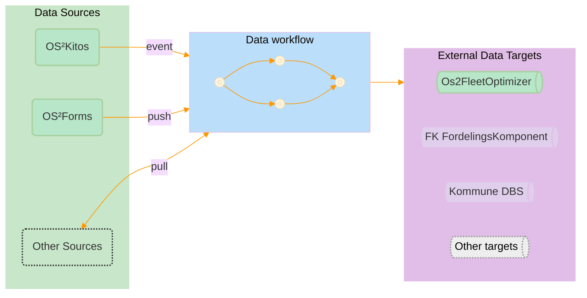

# Architectural overview of business components

```mermaid
---
config:
  theme: base
  themeVariables:
    lineColor: '#FF9800'
---
flowchart LR
 subgraph subGraph0["Data Sources"]
        A1["OS²Kitos<br>"]
        A2["OS²Forms<br>"]
        A3["Other Sources"]
  end
 subgraph s1["Data workflow"]
    direction LR
        n13["Frames Circle"]
        n14["Frames Circle"]
        n15["Frames Circle"]
        n16["Frames Circle"]
  end
 subgraph s2["External Data Targets"]
        n4["Os2FleetOptimizer"]
        n1["FK FordelingsKomponent<br>"]
        n2["Kommune DBS"]
        n3["Other targets"]
  end
    A1 -- event --> s1
    A2 -- push --> s1
    A3 <-- pull --> s1
    s1 --> s2
    n13 --> n14 & n16
    n14 --> n15
    n16 --> n15
    A3 ~~~ n3
    A1@{ shape: rounded}
    A2@{ shape: rounded}
    A3@{ shape: rounded}
    n13@{ shape: fr-circ}
    n14@{ shape: fr-circ}
    n15@{ shape: fr-circ}
    n16@{ shape: fr-circ}
    n4@{ shape: h-cyl}
    n1@{ shape: h-cyl}
    n2@{ shape: h-cyl}
    n3@{ shape: h-cyl}
     A1:::blue
     A1:::green
     A2:::blue
     A2:::green
     A3:::blue
     n4:::green
     n1:::purple
     n2:::purple
     n3:::Ash
    classDef blue fill:#a8d8ff,stroke:#333,stroke-width:2px
    classDef yellow fill:#fff2b2,stroke:#333,stroke-width:2px
    classDef orange fill:#ffd7b5,stroke:#333,stroke-width:2px
    classDef red fill:#ffb3ba,stroke:#333,stroke-width:2px
    classDef purple fill:#e0cfec, stroke:#E1BEE7, stroke-width:2px
    classDef Ash stroke-width:1px, stroke-dasharray:none, stroke:#999999, fill:#EEEEEE, color:#000000
    classDef Aqua stroke-width:1px, stroke-dasharray:none, stroke:#46EDC8, fill:#DEFFF8, color:#378E7A
    classDef green fill:#b8e6c9, stroke:#A8d0A0, stroke-width:2px
    classDef Peach stroke-width:1px, stroke-dasharray:none, stroke:#FBB35A, fill:#FFEFDB, color:#8F632D
    style A3 fill:transparent, stroke-width:2px,stroke-dasharray: 2
    style n3 stroke-width:2px,stroke-dasharray: 2
    style s1 stroke:#E1BEE7,fill:#BBDEFB
    style s2 stroke:none,fill:#E1BEE7
    style subGraph0 stroke:none,fill:#C8E6C9

```
