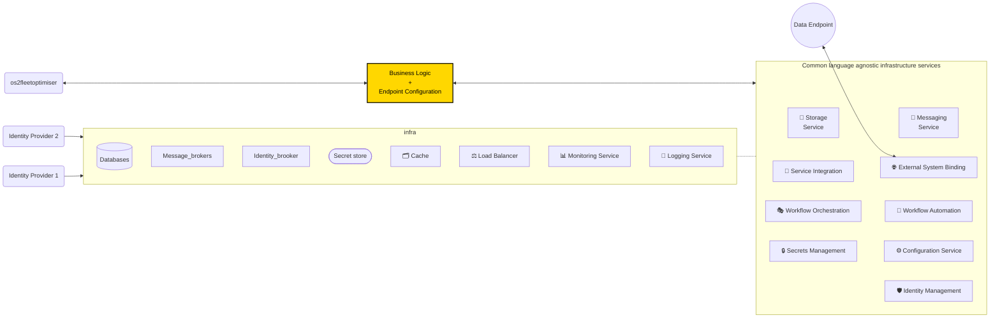

# Case Study

## Os2fleetoptimiser

**Med nuværende python/python library løsning skal udvikleren selv:**

- Implementere anvendelse af certifikater, tokens og andre secrets på en korrekt og sikker måde i duplikeret kode i alle extractors.
- Udvikle forbindelser, der kan "faile gracefully", og vedligeholde egne "retry" og "timeout" metoder til dataoverførsel, hvis endpointet fejler. Denne kode skal ligeledes duplikeres ud i alle extractors.
- Lave egne metoder til fejlhåndtering og logning af fejl og sikre, at hele systemet kan køre videre upåvirket.
- Implementere og vedligeholde egne funktioner til overvågning og notifikationer om kørsels status og fejl.
- Håndtere state management manuelt med egne funktioner, for at gemme og hente data fra filestores, databaser eller lign. for at sikre konsistens og robusthed.
- Alt dette ekstra "infrastruktur" kode skal vedligeholdes, opdateres og holdes sikkert og robust.
- Hvis der er ønsker om at skalere systemet f.eks med flere data-endpoints og services til at forbinde til disse, skal alt denne nye logik skrives i python og placeres inde i fleetoptimiser monolitten som designet er i dag.
- Som systemet skaleres med flere endoints bliver disse manuelle vedligeholdelsesopgaver naturligvis drastisk forøget.

**Med et generisk moderne abstraktionslag som f.eks Dapr kan I i stedet:**

- Få automatiseret håndtering af certifikater, tokens og secrets, retries, timeouts, fejlhåndtering og logning, hvilket reducerer duplikeret kode og vedligeholdelse betydeligt.
- Udnytte Dapr's sprogagnostiske design, så opsætning af endpoints ikke kun er bundet til python og få fordel mange flere udviklere der kan bidrage og vedligeholde i andre udviklingssprog.
- Få indbygget overvågning og tracing af kald på tværs af services, hvilket gør det lettere at identificere og løse problemer.
- Få automatiseret state management, hvilket betyder, at Dapr kan håndtere gemning og hentning af data fra forskellige lagringssystemer (som filer og databaser) for udviklingsteamet. Dette sikrer, at data altid er konsistent og tilgængelig uden manuel indsats.
- Åbne for at integrationerne med andre data-services, er simple og robuste at integrere med minimalt vedligehold.
- Få indbyggede værktøjer og metoder til at kunne modernisere systemet trinvist til en mere hændelsesdrevet, serviceorienteret og løskoblet arkitektur, der understøtter effektiv skalering inden for budget.

---

Klik her for at se en videotalk om emnet

 Dapr in Practice - Marc Klefter - NDC Oslo 2024

> _After this talk, you'll have gained a pathway for implementing and deploying Dapr in production and addressing common issues and pitfalls, based on learnings from organizations that have faced and solved them in the recent past._

---

# Solution overview

_an example with a single dataendpoint_

